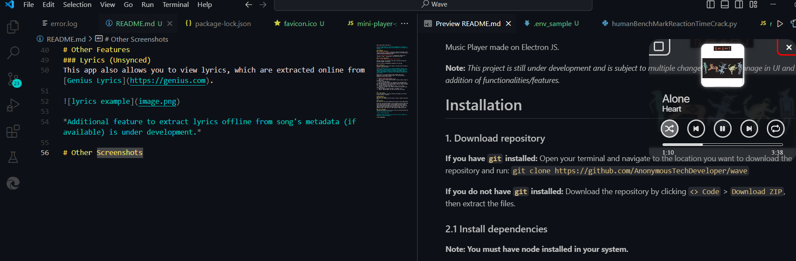

Music Player made on Electron JS.

**Note:** *This project is still under development and is subject to multiple changes including chnage in UI and addition of functionalities/features.*

# Installation 
### 1. Download repository
**If you have `git` installed:** Open your terminal and navigate to the location you want to download the repository and run: `git clone https://github.com/AnonymousTechDeveloper/wave`

**If you do not have `git` installed:** Download the repository by clicking `<> Code` > `Download ZIP`, then extract the files.

### 2.1 Install dependencies
**Note: You must have node installed in your system.**

Open your terminal and navigate to the repo's directory and type the following command: `npm install`

This will install the dependencies required to run the app.

### 2.2 (Optional) 
In order to use the online lyrics feature of the app, you first need to generate a genius API token. 

**Note:** *An API token is a very sensitive credentials because, just like passwords, they allow access to certain services across platforms. These can be misused if landed on wrong hands, for example- spam requests made through your account or making unauthorized transactions to the service-provider. Always make sure to keep your API tokens safe and a secret.*

Genius Lyrics is an online platform that provides song lyrics, annotations, and insights related to music. This app uses Genius' database to extract lyrics online.

**To generate a Genius API token:**
> 1. Head to `https://genius.com/api-clients`.
> 2. Sign up/Log in to your Genius account, creating a Genius account is absolutely free.
> 3. Click on 'New API Client'.
> 4. Fill up the asked details, only 'App Name' and 'App Website URL' are required fields, rest can be left blank. It doesn't matter what you fill for the 'App Name', and the 'App Website URL' just need to a valid URL, no matter which link you enter. 
> 5. Once you've filled all the required fields, click on 'Save'.
> 6. Generate a new (API) Access Token by clicking on 'Generate Access Token' and copy it.
> 7. Open the repo's directory and open `.env_sample` file.
> 8. Replace `YOUR_API_TOKEN` with the API token you just copied.

****

### 3. Run the app
To run the application, open your terminal and navigate to the repo's directory and run: `electron .`

# Other Features 
### Shuffle and Loops
Use shuffle and randomize the next song, or loops to repeat a particular song.

### Mini-player
Want control of your music playback while working on other applications? 

We got you, with the mini-player, you can continue to work on other apps while still have decent control on your playback without the need to switch windows again and again. The mini-player will always remain on top of other apps and provide basic info and controls, its size can be toggled to make it take even less space on your screen. It also partially hides itself while it is not focused to reduce distraction.

### Lyrics (Unsynced)
This app also allows you to view lyrics, which are extracted online from [Genius Lyrics](https://genius.com).

*Additional feature to extract lyrics offline from song's metadata (if available) is under development.*

# Other Screenshots

